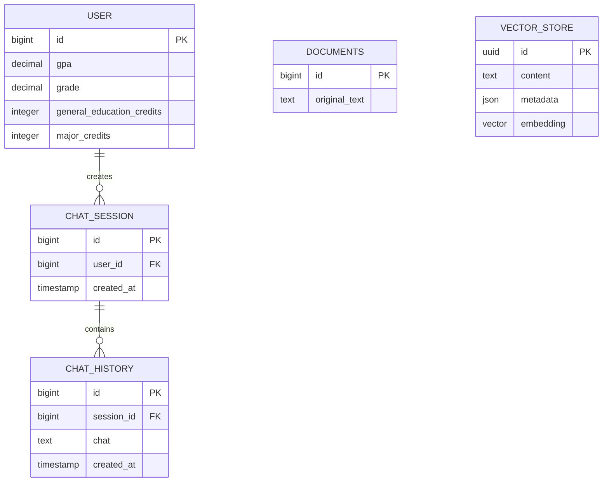

# Spring AI Mini Project 구조

## 1. 프로젝트 개요

이 프로젝트는 사용자 학사 정보를 바탕으로 대화 세션과 채팅 이력을 관리하고, 원문 데이터를 임베딩하여 유사도 검색에 활용하는 Spring Boot 애플리케이션이다.

- Java 21
- Spring Boot 4.1.0
- Spring AI 2.0.0
- Spring Data JPA
- PostgreSQL
- PGvector
- OpenAI Chat/Embedding 모델
- Gradle

## 2. 디렉터리 구조

```text
SpringAI-mini-project/
├── .env                         # 로컬 환경변수 및 비밀정보(Git 제외)
├── .env.example                 # 환경변수 작성 예시
├── build.gradle                 # 플러그인 및 의존성 설정
├── evaluation/                  # RAGAS 평가 스크립트와 실행 문서
├── golden-set/                  # BLOCK/ANSWER 평가용 골든셋
├── k6/                          # 챗봇 API 부하 테스트
├── settings.gradle              # Gradle 프로젝트 이름 설정
├── PROJECT_STRUCTURE.md         # 프로젝트 구조 문서
└── src/
    ├── main/
    │   ├── java/com/example/springai/
    │   │   ├── SpringAiApplication.java
    │   │   ├── controller/
    │   │   │   └── Controller.java
    │   │   ├── advisor/
    │   │   │   ├── GuardrailAdvisor.java
    │   │   │   └── GuardrailBlockedException.java
    │   │   ├── config/
    │   │   │   ├── ChatClientConfig.java
    │   │   │   └── ModelConfig.java
    │   │   ├── dto/
    │   │   │   ├── ChatAction.java
    │   │   │   ├── ChatRequest.java
    │   │   │   ├── ChatResponse.java
    │   │   │   └── UserAcademicInfoDto.java
    │   │   ├── service/
    │   │   │   ├── Service.java
    │   │   │   ├── Retriever.java
    │   │   │   └── AnswerGenerator.java
    │   │   ├── tool/
    │   │   │   ├── UserTool.java
    │   │   │   └── UserDataAccessDeniedException.java
    │   │   ├── entity/
    │   │   │   ├── User.java
    │   │   │   ├── Session.java
    │   │   │   ├── History.java
    │   │   │   └── Document.java
    │   │   └── repository/
    │   │       ├── UserRepository.java
    │   │       ├── SessionRepository.java
    │   │       ├── HistoryRepository.java
    │   │       └── DocumentRepository.java
    │   └── resources/
    │       ├── application.yaml
    │       └── prompts/
    │           ├── guardrail-system.st
    │           ├── rag-system.st
    │           └── rag-user.st
    └── test/
        └── java/com/example/springai/
            └── SpringAiApplicationTests.java
```

## 3. 패키지별 역할

| 패키지 | 역할 |
|---|---|
| `controller` | HTTP 요청을 받고 요청값 검증 및 응답 반환 |
| `advisor` | ChatClient 호출 전후의 가드레일 처리. 향후 Rewrite 노드에 연결 |
| `config` | ChatClient와 모델 옵션 구성 |
| `dto` | 채팅 요청·응답 및 사용자 학사정보 전송 객체 |
| `service` | RAG 검색, 답변 생성 및 유스케이스 조합 |
| `tool` | 현재 사용자 학사정보 조회와 코드 수준 접근 권한 검증 |
| `entity` | PostgreSQL의 일반 관계형 테이블과 매핑되는 JPA 엔티티 |
| `repository` | 엔티티의 조회 및 저장을 담당하는 Spring Data JPA 저장소 |
| `resources` | 데이터베이스, OpenAI, PGvector 등의 애플리케이션 설정 |

기본 의존 방향은 `Controller → Service → Retriever/AnswerGenerator → VectorStore/Tool`이다.
Controller에서 Repository를 직접 호출하지 않으며 사용자 데이터 접근은 `UserTool`이 담당한다.

## 4. 엔티티 및 관계



### `User`

사용자의 학사 정보를 저장한다. 학년(`grade`)은 `1.0`, `2.5`처럼 소수점 한 자리까지 저장한다. `users` 테이블을 사용하여 PostgreSQL 예약어 또는 일반적인 `user` 테이블 이름과의 충돌을 피한다.

### `Session`

사용자별 채팅 세션을 나타낸다. `User`와 지연 로딩 방식의 다대일 관계이며 실제 테이블 이름은 `chat_sessions`이다.

### `History`

세션에서 발생한 채팅 내용을 저장한다. `Session`과 지연 로딩 방식의 다대일 관계이며 실제 테이블 이름은 `chat_history`이다.

### `Document`

임베딩 전 원문 데이터를 `documents` 테이블에 보관한다. 임베딩 벡터를 이 엔티티에 직접 저장하지 않는다.

## 5. Vector Store

임베딩 전용 JPA 엔티티나 별도 임베딩 테이블은 만들지 않는다. Spring AI의 `PgVectorStore`를 사용하며, 애플리케이션 시작 시 다음 객체를 자동으로 준비한다.

- PostgreSQL 확장: `vector`, `hstore`, `uuid-ossp`
- 벡터 테이블: `public.vector_store`
- 검색 인덱스: HNSW
- 거리 계산: Cosine Distance

임베딩 차원은 `application.yaml`에서 고정하지 않고 선택된 OpenAI 임베딩 모델로부터 자동으로 결정한다. 모델이나 차원이 변경되면 기존 `vector_store` 테이블의 벡터 차원과 호환되는지 확인해야 한다.

## 6. 환경변수

로컬 실행에 사용하는 값은 `.env`에 작성한다. `.env`는 Git에서 제외되며 저장소에는 실제 API 키를 올리지 않는다.

| 변수 | 설명 | 기본/예시 값 |
|---|---|---|
| `DB_URL` | PostgreSQL JDBC 주소 | `jdbc:postgresql://localhost:5432/springai` |
| `DB_USERNAME` | PostgreSQL 사용자 | `postgres` |
| `DB_PASSWORD` | PostgreSQL 비밀번호 | `postgres` |
| `OPENAI_API_KEY` | OpenAI API 키 | `sk-...` |
| `OPENAI_CHAT_MODEL` | 채팅 모델 | `gpt-4.1-mini` |
| `OPENAI_EMBEDDING_MODEL` | 임베딩 모델 | `text-embedding-3-small` |
| `RAG_TOP_K` | 질문마다 검색할 유사 문서 개수 | `4` |
| `TOKEN_USAGE_AVERAGE_LIMIT` | 질의당 평균 total token 상한 | `2000` |

새 환경에서는 `.env.example`을 복사한 뒤 실제 접속 정보와 OpenAI API 키를 입력한다.

## 7. 현재 RAG 처리 흐름

1. Service가 사용자 질문을 받는다.
2. Retriever가 `RAG_TOP_K` 설정만큼 관련 청크를 Vector Store에서 검색한다.
3. AnswerGenerator가 검색 청크를 문맥으로 구성한다.
4. 개인 학사정보가 필요하면 ChatClient가 UserTool을 호출한다.
5. UserTool은 서버가 전달한 현재 사용자 ID만 조회하도록 코드에서 권한을 검증한다.
6. 답변 생성이 완료되면 Service가 `action=ANSWER`와 답변 및 검색 context를 반환한다.

현재 최종 답변용 `ChatClient`에는 `GuardrailAdvisor`를 전역 Advisor로 등록하지 않는다.
따라서 현 단계에서는 `BLOCK` 응답을 생성하지 않으며, Rewrite 노드 구현 전까지 정상 파이프라인 완료 결과는 `ANSWER`이다.

## 8. Rewrite 및 가드레일 적용 계획

향후 Rewrite 노드를 파이프라인 가장 앞에 추가하고 이 노드에 `GuardrailAdvisor`를 연결해야 한다.

```text
사용자 질문
→ Rewrite + GuardrailAdvisor
   ├─ BLOCK: 즉시 action=BLOCK 응답, 검색 및 Tool 호출 생략
   └─ 통과: 검색용 질문 생성
→ Retriever
→ AnswerGenerator + UserTool
→ action=ANSWER
```

Rewrite 단계의 책임은 다음과 같다.

- 학사 업무 범위를 벗어난 질문 차단
- 프롬프트 인젝션 및 시스템 지시 탈취 시도 차단
- 타인 개인정보 요청 차단
- 허용된 질문을 검색에 적합한 형태로 재작성
- 차단 결과에는 `BLOCK`, 통과 결과에는 재작성된 검색어 전달

최종 답변 프롬프트는 요청 분류를 다시 수행하지 않는다. 다만 검색 문서에 포함된 명령을
따르지 않는 문서 인젝션 방어 규칙과 `UserTool`의 코드 수준 권한 검사는 유지한다.

## 9. 평가

- `golden-set/`: 공격·무관 질문 10개와 정상 RAG 질문 10개
- `evaluation/`: BLOCK 분기와 RAGAS Faithfulness/FactualCorrectness 평가
- `k6/`: 챗봇 API의 응답시간, 오류율 및 동시 사용자 부하 평가

RAGAS 평가에서 `BLOCK` 케이스는 Rewrite 노드 구현 후 활성화된다.

## 10. 실행 전 확인사항

- Java 21이 설치되어 있어야 한다.
- PostgreSQL에 `springai` 데이터베이스가 생성되어 있어야 한다.
- PostgreSQL 서버에 PGvector가 설치되어 있어야 한다.
- 데이터베이스 계정에 테이블과 확장을 생성할 권한이 있어야 한다.
- `.env`의 `OPENAI_API_KEY`를 실제 키로 교체해야 한다.

```bash
./gradlew bootRun
```

컴파일만 확인하려면 다음 명령을 사용한다.

```bash
./gradlew compileJava
```
