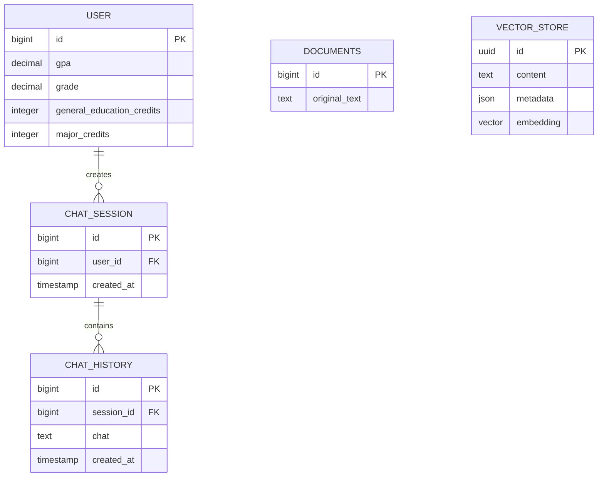

# Spring AI Mini Project 구조

## 1. 프로젝트 개요

이 프로젝트는 사용자 학사 정보를 바탕으로 대화 세션과 채팅 이력을 관리하고, 원문 데이터를 임베딩하여 유사도 검색에 활용하는 Spring Boot 애플리케이션이다.

- Java 21
- Spring Boot 4.1.0
- Spring AI 2.0.0
- Spring Data JPA
- PostgreSQL
- PGvector
- OpenAI Chat/Embedding 모델
- Gradle

## 2. 디렉터리 구조

```text
SpringAI-mini-project/
├── .env                         # 로컬 환경변수 및 비밀정보(Git 제외)
├── .env.example                 # 환경변수 작성 예시
├── build.gradle                 # 플러그인 및 의존성 설정
├── chunk-dump/                  # 청킹 전략 비교와 유사도 측정 결과(코드 아님, 근거 자료)
├── evaluation/                  # RAGAS 평가 스크립트와 실행 문서
├── golden-set/                  # BLOCK/ANSWER 평가용 골든셋
├── k6/                          # 챗봇 API 부하 테스트
├── settings.gradle              # Gradle 프로젝트 이름 설정
├── PROJECT_STRUCTURE.md         # 프로젝트 구조 문서
└── src/
    ├── main/
    │   ├── java/com/example/springai/
    │   │   ├── SpringAiApplication.java
    │   │   ├── controller/
    │   │   │   └── Controller.java
    │   │   ├── advisor/
    │   │   │   ├── GuardrailAdvisor.java
    │   │   │   └── GuardrailBlockedException.java
    │   │   ├── config/
    │   │   │   ├── ChatClientConfig.java
    │   │   │   ├── ChatMemoryConfig.java
    │   │   │   ├── ModelConfig.java
    │   │   │   ├── ApiKeyStartupCheck.java
    │   │   │   └── GoldenSetUserSeeder.java
    │   │   ├── dto/
    │   │   │   ├── ChatAction.java
    │   │   │   ├── ChatRequest.java
    │   │   │   ├── ChatResponse.java
    │   │   │   ├── Source.java
    │   │   │   └── UserAcademicInfoDto.java
    │   │   ├── rag/
    │   │   │   ├── IngestService.java
    │   │   │   └── MarkdownHeadingSplitter.java
    │   │   ├── service/
    │   │   │   ├── Service.java
    │   │   │   ├── QueryRewriter.java
    │   │   │   ├── Retriever.java
    │   │   │   ├── AnswerGenerator.java
    │   │   │   ├── ConversationIds.java
    │   │   │   └── Sources.java
    │   │   ├── tool/
    │   │   │   ├── UserTool.java
    │   │   │   └── UserDataAccessDeniedException.java
    │   │   ├── entity/
    │   │   │   ├── User.java
    │   │   │   ├── Session.java
    │   │   │   ├── History.java
    │   │   │   └── Document.java
    │   │   └── repository/
    │   │       ├── UserRepository.java
    │   │       ├── SessionRepository.java
    │   │       ├── HistoryRepository.java
    │   │       └── DocumentRepository.java
    │   └── resources/
    │       ├── application.yaml
    │       ├── docs/                    # 학칙 원문 마크다운 5종(인제스트 입력)
    │       └── prompts/
    │           ├── guardrail-system.st
    │           ├── rag-system.st
    │           ├── rag-user.st
    │           ├── rewrite-system.st
    │           └── rewrite-user.st
    └── test/
        └── java/com/example/springai/
            ├── SpringAiApplicationTests.java
            └── rag/
                ├── ChunkDumpTest.java           # 800토큰 청킹 결과 덤프
                ├── HeadingChunkDumpTest.java    # `##` 청킹 결과 덤프
                ├── IngestRunnerTest.java        # 문서 인제스트 실행
                └── SimilarityThresholdTest.java # 유사도 임계값 측정
```

## 3. 패키지별 역할

| 패키지 | 역할 |
|---|---|
| `controller` | HTTP 요청을 받고 요청값 검증 및 응답 반환 |
| `advisor` | ChatClient 호출 전후의 가드레일 처리. 질문 재작성 호출에 부착된다 |
| `config` | ChatClient와 모델 옵션 구성 |
| `dto` | 채팅 요청·응답 및 사용자 학사정보 전송 객체 |
| `rag` | 학칙 문서를 청크로 나누고 임베딩하여 Vector Store에 적재 |
| `service` | 질문 재작성, RAG 검색, 답변 생성 및 유스케이스 조합 |
| `tool` | 현재 사용자 학사정보 조회와 코드 수준 접근 권한 검증 |
| `entity` | PostgreSQL의 일반 관계형 테이블과 매핑되는 JPA 엔티티 |
| `repository` | 엔티티의 조회 및 저장을 담당하는 Spring Data JPA 저장소 |
| `resources` | 데이터베이스, OpenAI, PGvector 등의 애플리케이션 설정 |

기본 의존 방향은 `Controller → Service → QueryRewriter/Retriever/AnswerGenerator → VectorStore/Tool`이다.
Controller에서 Repository를 직접 호출하지 않으며 사용자 데이터 접근은 `UserTool`이 담당한다.

## 4. 엔티티 및 관계



### `User`

사용자의 학사 정보를 저장한다. 학년(`grade`)은 `1.0`, `2.5`처럼 소수점 한 자리까지 저장한다. `users` 테이블을 사용하여 PostgreSQL 예약어 또는 일반적인 `user` 테이블 이름과의 충돌을 피한다.

### `Session`

사용자별 채팅 세션을 나타낸다. `User`와 지연 로딩 방식의 다대일 관계이며 실제 테이블 이름은 `chat_sessions`이다.

현재는 사용하지 않는다. 멀티턴 맥락은 Spring AI의 `SPRING_AI_CHAT_MEMORY` 표가 담당한다.

### `History`

세션에서 발생한 채팅 내용을 저장한다. `Session`과 지연 로딩 방식의 다대일 관계이며 실제 테이블 이름은 `chat_history`이다.

현재는 사용하지 않는다. 감사 목적의 이력을 이 표에 남길지는 별도로 정한다.

### `Document`

임베딩 전 원문 데이터를 `documents` 테이블에 보관한다. 임베딩 벡터를 이 엔티티에 직접 저장하지 않는다.

현재는 사용하지 않는다. 학칙 원문은 `src/main/resources/docs`에 파일로 관리하므로 데이터베이스에
사본을 두지 않는다.

## 5. Vector Store

임베딩 전용 JPA 엔티티나 별도 임베딩 테이블은 만들지 않는다. Spring AI의 `PgVectorStore`를 사용하며, 애플리케이션 시작 시 다음 객체를 자동으로 준비한다.

- PostgreSQL 확장: `vector`, `hstore`, `uuid-ossp`
- 벡터 테이블: `public.vector_store`
- 검색 인덱스: HNSW
- 거리 계산: Cosine Distance

임베딩 차원은 `application.yaml`에서 고정하지 않고 선택된 OpenAI 임베딩 모델로부터 자동으로 결정한다. 모델이나 차원이 변경되면 기존 `vector_store` 테이블의 벡터 차원과 호환되는지 확인해야 한다.

## 6. 문서 인제스트

`src/main/resources/docs`의 학칙 마크다운 5종을 청크로 나눠 임베딩한 뒤 `vector_store`에 저장한다.
`IngestService`가 문서 단위로 삭제한 뒤 다시 넣으므로 여러 번 실행해도 같은 청크가 쌓이지 않는다.

새 환경에서는 다음 명령으로 벡터를 채운다. 벡터는 Git에 올리지 않으므로 각자 한 번 실행해야 한다.

```bash
./gradlew test --tests "*IngestRunnerTest*"
```

### 청킹 단위

토큰 수가 아니라 문서가 표시해 둔 `##` 제목을 청크 경계로 삼는다(`MarkdownHeadingSplitter`).
처음에는 800토큰으로 잘랐으나 제목과 본문이 서로 다른 청크로 갈리는 문제가 있었다. 근거는
`chunk-dump/token800`과 `chunk-dump/heading`을 비교하면 확인할 수 있다.

| 지표 | 800토큰 | `##` 제목 |
|---|---:|---:|
| 청크 수 | 17 | 74 |
| 제목 없이 본문부터 시작 | 11/17 | 0/74 |
| 제목만 남고 본문은 다음 청크로 | 7/17 | 0/74 |

`##` 없이 `#` 바로 아래에 본문이 오는 구간 9개도 청크로 만든다. 그렇지 않으면 "졸업 성적요건" 같은
조항이 통째로 빠진다. 각 청크 앞에는 `[문서 > 상위 제목]` 경로를 붙여 맥락을 보존한다.

### 청크 메타데이터

출처 표기와 재색인에 사용한다.

| 키 | 예시 |
|---|---|
| `source` | `졸업요건.md` |
| `title` | `졸업 요건` |
| `section` | `졸업자격인증 사회봉사영역` |
| `heading` | `사회봉사영역 인증기준` |
| `version` | 인제스트 날짜 |
| `chunkStrategy` | `heading` |

### 유사도 임계값

`RAG_SIMILARITY_THRESHOLD` 기본값 `0.54`는 임의로 정한 값이 아니라 측정 결과다.
`SimilarityThresholdTest`가 실제 파이프라인과 같은 경로로 점수 분포를 재고
`chunk-dump/threshold/_report.md`에 남긴다.

- 문서가 답을 담고 있는 질문의 1위 점수: 0.593 ~ 0.738
- 학사 질문이지만 문서에 없는 경우의 1위 점수: 0.432 ~ 0.530

두 집단 사이에서 필요한 근거를 자르지 않는 값으로 `0.54`를 골랐다. 문서를 추가하면 다시 측정한다.

```bash
./gradlew test --tests "*SimilarityThresholdTest*"
```

## 7. 환경변수

로컬 실행에 사용하는 값은 `.env`에 작성한다. `.env`는 Git에서 제외되며 저장소에는 실제 API 키를 올리지 않는다.

| 변수 | 설명 | 기본/예시 값 |
|---|---|---|
| `DB_URL` | PostgreSQL JDBC 주소 | `jdbc:postgresql://localhost:5432/springai` |
| `DB_USERNAME` | PostgreSQL 사용자 | `postgres` |
| `DB_PASSWORD` | PostgreSQL 비밀번호 | `postgres` |
| `OPENAI_API_KEY` | OpenAI API 키 | `sk-...` |
| `OPENAI_CHAT_MODEL` | 채팅 모델 | `gpt-4.1-mini` |
| `OPENAI_EMBEDDING_MODEL` | 임베딩 모델 | `text-embedding-3-small` |
| `RAG_TOP_K` | 질문마다 검색할 유사 문서 개수 | `8` |
| `RAG_SIMILARITY_THRESHOLD` | 검색 결과로 인정할 코사인 유사도 하한 | `0.54` |
| `CHAT_MEMORY_MAX_MESSAGES` | 대화 메모리에 유지할 최근 메시지 수 | `20` |
| `TOKEN_USAGE_AVERAGE_LIMIT` | 질의당 평균 total token 상한 | `2000` |

새 환경에서는 `.env.example`을 복사한 뒤 실제 접속 정보와 OpenAI API 키를 입력한다.

셸에 `OPENAI_API_KEY`가 남아 있으면 `.env`보다 우선하여 적용된다. 기동 시 `ApiKeyStartupCheck`가
두 값이 다르면 경고를 남기므로, 옛 키가 잡힌다면 `unset OPENAI_API_KEY` 후 다시 실행한다.

## 8. 요청 처리 흐름

```text
POST /api/v1/chat         { message, userId?, sessionId? }   # 동기 JSON
POST /api/v1/chat/stream  { message, userId?, sessionId? }   # SSE
→ QueryRewriter + GuardrailAdvisor      # LLM 1회. 가드레일 주입 후 재작성
   ├─ [[BLOCK]] : action=BLOCK 즉시 반환, 검색과 Tool 호출 생략
   └─ 통과      : 검색용으로 재작성된 질문
→ Retriever                              # top-k + 유사도 임계값
→ AnswerGenerator + UserTool             # LLM 1회
→ action=ANSWER, answer, contexts, sources
```

1. `ConversationIds`가 `userId`와 `sessionId`를 묶어 대화 식별자를 만든다. `sessionId`가 없으면 단발성 질의다.
2. `QueryRewriter`가 대화 이력과 함께 질문을 넘겨 검색어를 만든다. 이 호출에만 `GuardrailAdvisor`를 붙인다.
3. `Retriever`가 재작성된 검색어로 청크를 찾는다. 임계값 미만은 버리므로 결과가 0건일 수 있다.
4. `AnswerGenerator`는 **사용자가 실제로 입력한 원문**으로 답변을 만든다. 재작성문으로 답하면
   "내 학점" 같은 개인화 단서가 사라져 `UserTool`을 호출할 이유가 없어진다.
5. 개인 학사정보가 필요하면 `UserTool`을 호출한다. `userId`가 없으면 도구 자체를 노출하지 않는다.
6. `Sources`가 청크 메타데이터에서 출처를 뽑아 응답에 담는다.

### 응답 필드

| 필드 | 의미 |
|---|---|
| `action` | `ANSWER` 또는 `BLOCK` |
| `answer` | 답변 본문, 또는 차단 사유 |
| `contexts` | 모델에게 전달한 청크 본문. RAGAS 평가가 이 값을 사용한다 |
| `sources` | 각 청크의 출처. `contexts`와 순서가 대응한다 |

`sources`는 모델에게 **전달한** 근거 전체이고, 답변 마지막 줄의 `출처:`는 모델이 **인용한** 것만이다.

### 스트리밍

`POST /api/v1/chat/stream`은 같은 파이프라인을 지나며 전달 방식만 다르다. 가드레일과 질문 재작성,
대화 이력이 동일하게 적용된다. 스트리밍만 우회 경로가 되면 차단이 무의미해지기 때문이다.

| 이벤트 | 의미 |
|---|---|
| `connected` | 스트림 시작 |
| `token` | 답변 조각 |
| `block` | 가드레일 차단. 동기 응답의 `action=BLOCK`에 대응하며 토큰은 오지 않는다 |
| `completed` | 스트림 종료 |
| `error` | 생성 중 오류 |

답변 전체는 스트림이 끝나야 완성되므로 대화 기록도 그 시점에 저장한다.

### 토큰 계측

`TokenUsageMetrics`가 응답 메타데이터의 `Usage`를 Micrometer에 기록한다. 동기와 스트리밍 모두 대상이다.

| 지표 | 의미 |
|---|---|
| `chat.query.tokens` | 질의당 총 토큰 분포 |
| `chat.query.tokens.average` | 질의당 평균 토큰 |
| `chat.query.tokens.average.limit` | 설정된 상한(`TOKEN_USAGE_AVERAGE_LIMIT`) |
| `chat.query.tokens.average.compliant` | 평균이 상한 이내면 1, 아니면 0 |

`/actuator/metrics`와 `/actuator/prometheus`로 노출된다.

## 9. 멀티턴 대화

"그거 연장하려면?" 같은 지시어를 앞 대화로 되돌려 답한다.

- 저장소는 자동 구성된 `JdbcChatMemoryRepository`이며 `SPRING_AI_CHAT_MEMORY` 테이블을 쓴다.
  재시작해도 맥락이 유지된다.
- `MessageWindowChatMemory`가 최근 `CHAT_MEMORY_MAX_MESSAGES`개만 남긴다.
- 대화 식별자는 `userId:sessionId` 형태다. 세션만으로 구분하면 다른 사용자가 같은 세션 값을
  보냈을 때 대화가 섞인다. 36자를 넘으면 결정적 UUID로 접는다.
- 이력은 두 곳에서 쓰인다. `QueryRewriter`에는 텍스트로 넣어 지시어를 풀고,
  `AnswerGenerator`에는 `Message` 목록으로 넣어 대화 흐름을 유지한다.
- 저장은 `AnswerGenerator`가 직접 한다. `MessageChatMemoryAdvisor`를 쓰면 렌더링된 사용자
  메시지가 그대로 기록되는데, 여기에는 검색된 청크 전문이 들어 있어 턴마다 문서 본문이 쌓인다.
  질문과 답변만 남겨 기록을 깨끗하게 유지한다.
- 차단된 요청은 `AnswerGenerator`까지 가지 않으므로 기록되지 않는다.

`chat_sessions`와 `chat_history` 엔티티는 현재 사용하지 않는다. 감사 목적의 이력 저장을
이 표에 둘지는 별도로 정한다.

## 10. 평가

| 대상 | 내용 |
|---|---|
| `golden-set/` | 차단 대상 14건과 정상 RAG 질문 10건, 총 24건 |
| `evaluation/` | BLOCK/ANSWER 분기 정확도와 RAGAS Faithfulness/FactualCorrectness |
| `k6/` | 응답시간, 오류율, 동시 사용자 부하 |

골든셋의 차단 케이스에는 정당한 학사 질문과 공격을 한 문장에 섞은 `mixed_injection` 4건이 포함된다.
정상 질문만으로는 드러나지 않는 우회를 잡기 위한 것으로, 재작성 단계가 문장별로 판정하지 않으면 통과한다.

```bash
CHAT_EVAL_USER_IDS='{"answer-006":1,"answer-007":2,"answer-008":3,"answer-009":4}' \
  python evaluation/evaluate.py

k6 run k6/chatbot-load-test.js
```

`user_entity_and_rag` 케이스는 `userId`로 학사정보를 조회하므로 `users` 테이블에 해당 행이 있어야 한다.
`GoldenSetUserSeeder`가 기동 시 비어 있을 때만 1~4번 사용자를 넣는다.

## 11. 실행 전 확인사항

- Java 21이 설치되어 있어야 한다.
- `.env`의 `DB_URL`이 가리키는 PostgreSQL이 실행 중이어야 한다.
- PostgreSQL 서버에 PGvector가 설치되어 있어야 한다.
- 데이터베이스 계정에 테이블과 확장을 생성할 권한이 있어야 한다.
- `.env`의 `OPENAI_API_KEY`를 실제 키로 교체해야 한다.

```bash
./gradlew bootRun
```

처음 실행하는 환경이라면 벡터를 채워야 한다. 벡터는 Git에 포함되지 않는다.

```bash
./gradlew test --tests "*IngestRunnerTest*"
```

컴파일만 확인하려면 다음 명령을 사용한다.

```bash
./gradlew compileJava
```
